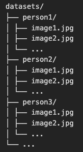

# attendance-system

#### How to use

#### Setup

##### Pre-requisite before setup

install python pip

- create a virtual environment using python and pip
- run pip install `requirements.txt` a file in the root directory
- create a dataset directory in the root directory with a dataset in the following format:

  datasets/
  ├── person1/
  │ ├── image1.jpg
  │ ├── image2.jpg
  │ └── ...
  ├── person2/
  │ ├── image1.jpg
  │ ├── image2.jpg
  │ └── ...
  ├── person3/
  │ ├── image1.jpg
  │ ├── image2.jpg
  │ └── ...
  └── ...

  

  where the person is the name of the people in the class and the images their images.

- run python attendance-sys.py

- this should spin up video player from the machine
- grant all the require permissions

currently all attendance taken is saved in the attendance.txt file in the root of the directory
